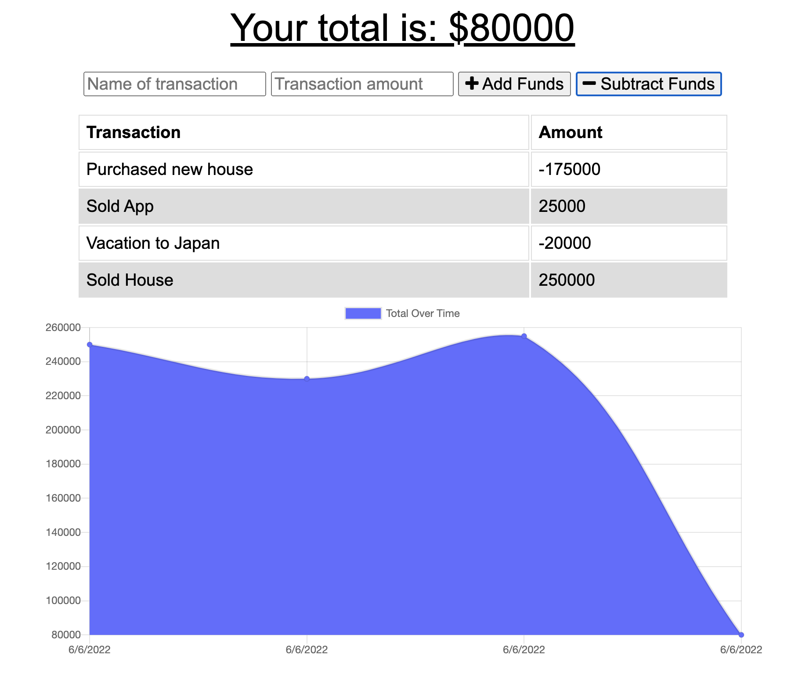

# Budget Tracker

 ## Description

 This application involved a refactor of existing code to include IndexedDB for offline functionality, code for a service worker to serve cached files in case of low connectivity, and a web manifest to allow installation of the app as a PWA.    

## Table of Contents

  
  - [Installation](#installation)
  - [Usage](#usage)
  - [Images](#images)
  - [Contributing](#contributing)
  - [Questions](#questions)

  ## Installation

  The user should clone the repository from GitHub and install all the dependencies using "npm install." 

  ## Usage

  The deployed app is available using the following link:  <a href="https://whispering-brook-54265.herokuapp.com/">Deployed App</a>

  ## Images
  
  ## Contributing

  This application was create by Sheroo Bhagia with code contributed from the coding boot camp at the University of Texas.  I welcome any comments, suggestions or questions.  

  ## Questions

  My Github page is: https://github.com/greenmanaustin

  You can reach me with questions at: sheroo.bhagia@gmail.com